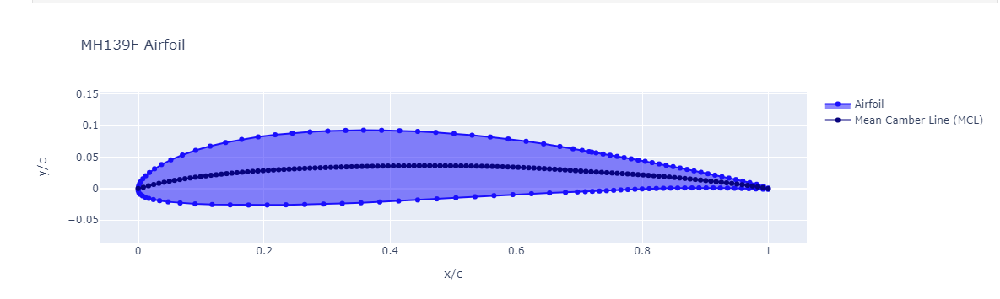
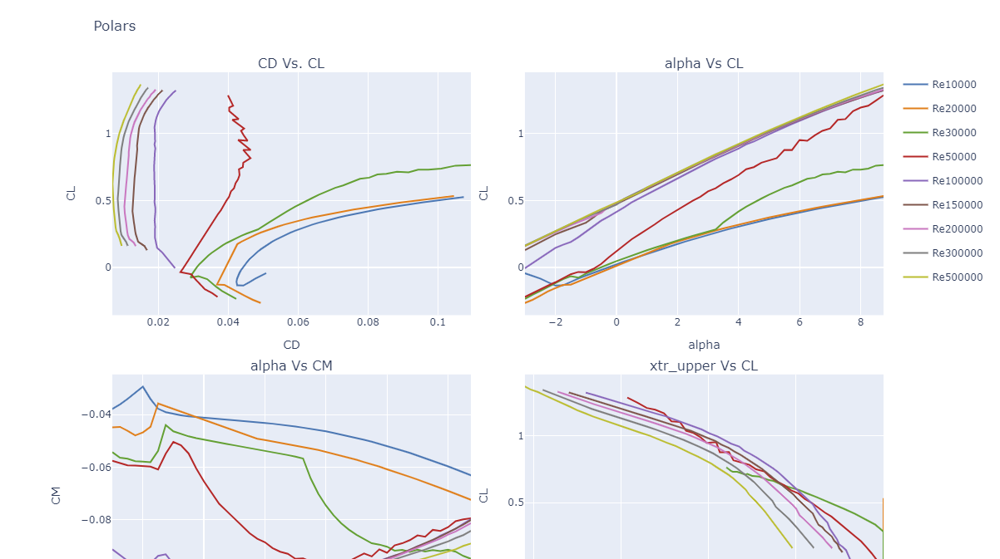
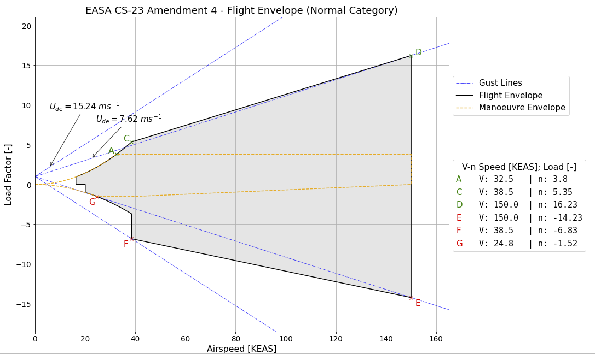

Docker build of jupyter with Aero design software installed:

Xfoil - compiled with intel fortran compiler.  compiler docker image is 6gb so make sure you have space
   I tried the gnu fortran compiler but compiled program was unstable.
https://web.mit.edu/drela/Public/web/xfoil/

AVL - aerodynamic and flight-dynamic analysis of rigid aircraft of arbitrary configuration.
https://web.mit.edu/drela/Public/web/avl/

AeroSandbox -  Aircraft design optimization made fast through modern automatic differentiation.
https://github.com/peterdsharpe/AeroSandbox

ADRPy - Aircraft Design Recipes in Python, https://github.com/sobester/ADRpy

OpenVSP - 3D parametric vehicle sketch pad with python api.  http://openvsp.org/.

(more softwares can be added)

Running From Dockerhub
----------------------

docker run -p 8888:8888 overpoweredmechanisms/aerojup

When running, you will see output on how to connect to the jupyerlab using a browser.  It will look something like:

http://127.0.0.1:8888/lab?token=c9118b1c6cc5453ca28c559f85a1aa1dc19b7998c41594b8

In the root directory, there is a jupyter notebook called aerodesign that shows some examples:

- Create and draw 3d geometry of a plane
- Draw a 2d airfoil
- calculate polars for a 2D airfoil using Xfoil and graph them
- generate V-D diagram

Building
--------
cd docker
docker build -t aerodesign ./

